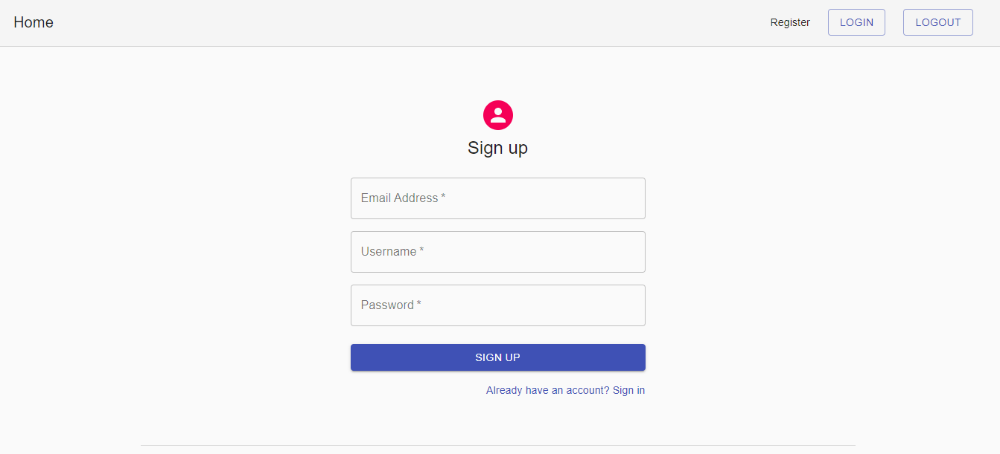
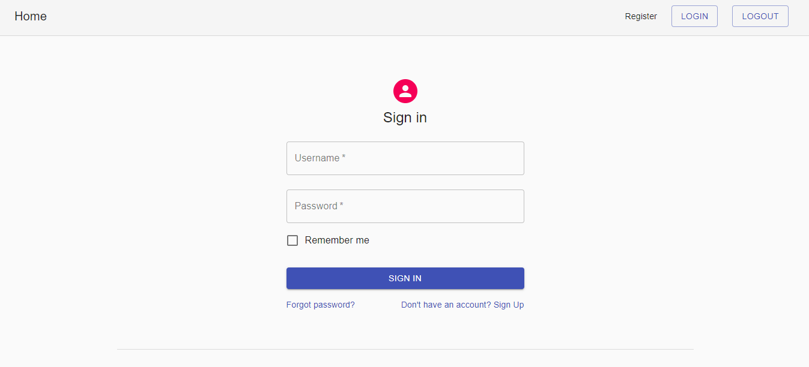

# Django Login

A functional login process implemented with Django REST Framework, React, MaterialUI.

## Features

- User login,logout, registration
- Login authentication
- Token based authentication - JWT access and refresh tokens

## Quick Glance

